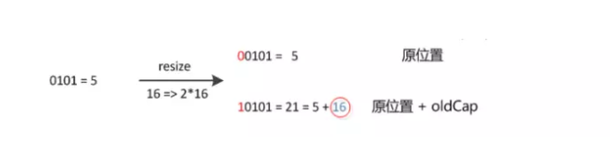

# 一、什么是Hash #
	Hash音译为“哈希”，直译为“散列”，是一种信息摘要算法，但他不是加密。散列函数（或散列算法，又称哈希函数，英语：Hash Function）是一种从任何一种数据中创建小的数字“指纹”的方法。散列函数把消息或数据压缩成摘要，使得数据量变小，将数据的格式固定下来。该函数将数据打乱混合，重新创建一个叫做散列值（hash values，hash codes，hash sums，或hashes）的指纹(维基百科)。
 我们平时常用的MD5，SSL等都属于Hash算法，通过Key进行Hash的计算，就可以获取Key对应的HashCode。ArrayList和LinkedList的优缺点——数组的特点是：寻址容易，插入和删除困难；而链表的特点是：寻址困难，插入和删除容易。如果我们综合两者的特点，就可以得HashMap(直译散列表，音译哈希表)。我们知道，java.util中的clloection集合类中， 最为常用的两种是List和Map类，ArrayList和LinkedList都是List集合类旗下的，而HashMap则是属于Map集合的阵营。为什么说HashMap集合了前面两种数据结构的特点呢？HashMap最常见的实现方法是拉链法——即一系列链表为数组元素组成的数组。    

    
 
HashMap由链表+数组组成，他的底层结构是一个数组，而数组的元素是一个单向链表。图中是一个长度为16位的数组，每个数组储存的元素代表的是每一个链表的头结点。   
通过Key进行Hash的计算，就可以获取Key对应的HashCode。好的Hash算法可以计算出几乎出独一无二的HashCode，如果出现了重复的hashCode，就称作碰撞，就算是MD5这样优秀的算法也会发生碰撞，即两个不同的key也有可能生成相同的MD5。正常情况下，我们通过hash算法，往HashMap的数组中插入元素。如果发生了碰撞事件，那么意味这数组的一个位置要插入两个或者多个元素，这个时候数组上面挂的链表起作用了，链表会将数组某个节点上多出的元素按照尾插法(jdk1.7及以前为头差法)的方式添加。
# 二、HashMap的内部实现机制 #
## 1.HashMap基本元素 ##
	public class HashMap<K,V> extends AbstractMap<K,V>
    implements Map<K,V>, Cloneable, Serializable {
    ......

    //默认初始容量为16，这里这个数组的容量必须为2的n次幂。
    static final int DEFAULT_INITIAL_CAPACITY = 1 << 4; // aka 16

    //最大容量为2的30次方
    static final int MAXIMUM_CAPACITY = 1 << 30;

    //默认加载因子
    static final float DEFAULT_LOAD_FACTOR = 0.75f;

    //以Node<K,V>为元素的数组，也就是上图HashMap的纵向的长链数组，起长度必须为2的n次幂
    transient Node<K,V>[] table;

    //已经储存的Node<key,value>的数量，包括数组中的和链表中的
    transient int size;

    //扩容的临界值，或者所能容纳的key-value对的极限。当size>threshold的时候就会扩容
    int threshold;

    //加载因子
    final float loadFactor;
    ......
1. DEFAULT_INITIAL_CAPACITY&MAXIMUM_CAPACITY  
首先当我们通过无参的构造函数new一个hashMap的时候，系统就会帮我们指定你HashMap的默认大小为DEFAULT_INITIAL_CAPACITY也就是24，当然我们可以刻自己制定初始容量的大小，只不过要注意必须是2^n且小于MAXIMUM_CAPACITY(2^30)。
2. DEFAULT_LOAD_FACTOR&loadFactor  
LOAD_FACTOR(负载因子)和上面的CAPACITY(容量)的关系，简单来说,Capacity就是数组的长度/大小，loadFactor是这个数组填满程度的最大比比例。同样的，我们可以根据有参的HashMap构造函数来指定初始负载容量的大小，如果不指定，默认的负载因子为0.75。
3. size&threshold  
size表示当前HashMap中已经储存的Node<key,value>的数量，包括数组和链表中的的Node<key,value>。threshold表示扩容的临界值，如果size大于这个值，则必需调用resize()方法进行扩容。    先说一下threshold值是怎么得到的，在jdk1.7及以前，threshold = length * Loadfactor，其中length为数组的长度，也就是说数组的长度成负载因子的数量。这里需要说明一点，默认负载因子0.75是是对空间和时间(纵向横向)效率的一个平衡选择，建议大家不要修改。而在jdk1.8中，这个值的计算算法得到了进一步改进，成了这个：  

		static final int tableSizeFor(int cap) {
			int n = cap - 1;
			n |= n >>> 1;
			n |= n >>> 2;
			n |= n >>> 4;
			n |= n >>> 8;
			n |= n >>> 16;
			return (n < 0) ? 1 : (n >= MAXIMUM_CAPACITY) ? MAXIMUM_CAPACITY : n + 1;
		}
cap是我们初始传递的Capacity值(或者默认的2^4)，看注释我们可以知道，这么一系列位移操作算法最后是为了得到一个power of two size的值。为什么jdk中一再要强调这个2^n这个值呢？这个等会再分析。
4. Node<K,V>[] table   
他是整个HashMap的组成子元素，是构成HashMap的一砖一瓦  

    	static class Node<K,V> implements Map.Entry<K,V> {
	        final int hash;     //每个储存元素key的哈希值
	        final K key;        //key
	        V value;            //value
	        Node<K,V> next;     //链表下一个node
	
	        Node(int hash, K key, V value, Node<K,V> next) {
	            this.hash = hash;
	            ......
	        }
	
	        public final K getKey()        { return key; }
	        public final V getValue()      { return value; }
	        public final String toString() { return key + "=" + value; }
	        public final int hashCode() { ...... }
	        public final V setValue(V newValue) { ...... }
	        public final boolean equals(Object o) { ....... }
		}
可以看到，这个Node<K,V>[]是HashMap的一个内部类，他既是HashMap底层数组的组成元素，又是每个单向链表的组成元素。它其中包含了数组元素所需要的key与value，以及链表所需要的指向下一个节点的引用域next。当然这个hash值是系统在创建Node时通过一定的算法计算出来的一个int值。  
## 2.HashMap构造函数 ##
	    public HashMap(int initialCapacity, float loadFactor) {
	        if (initialCapacity < 0)
	            throw new IllegalArgumentException("Illegal initial capacity: " +
	                                               initialCapacity);
	        if (initialCapacity > MAXIMUM_CAPACITY)
	            initialCapacity = MAXIMUM_CAPACITY;
	        if (loadFactor <= 0 || Float.isNaN(loadFactor))
	            throw new IllegalArgumentException("Illegal load factor: " +
	                                               loadFactor);
	        this.loadFactor = loadFactor;
	        this.threshold = tableSizeFor(initialCapacity);
	    }
	
	    public HashMap(int initialCapacity) {
	        this(initialCapacity, DEFAULT_LOAD_FACTOR);
	    }
	
	    public HashMap() {
	        this.loadFactor = DEFAULT_LOAD_FACTOR; // all other fields defaulted
	    }
	
	    public HashMap(Map<? extends K, ? extends V> m) {   
	        this.loadFactor = DEFAULT_LOAD_FACTOR;
	        putMapEntries(m, false);
	    }

## 3.HashMap的put添加功能实现 ##
	    public V put(K key, V value) {
        return putVal(hash(key), key, value, false, true);
    }

    final V putVal(int hash, K key, V value, boolean onlyIfAbsent, boolean evict) {
        Node<K,V>[] tab; Node<K,V> p; int n, i;     //tab[]为数组，p是每个桶
 	 ①      if ((tab = table) == null || (n = tab.length) == 0) //第一步，table为空，则调用resize()函数创建一个
            n = (tab = resize()).length;
	 ②      if ((p = tab[i = (n - 1) & hash]) == null)   //第二步，计算元素所要储存的位置index,并对null做出处理
            //注意这里，如果tab[i]==null，说明这个位置上没有元素，这个时候就创建一个新的Node元素
            tab[i] = newNode(hash, key, value, null);
        else {  //else,否则，也就是，这个要添加的位置上面已经有元素了，也就是发生了碰撞。这个时候就要具体情况分
                //类讨论：1.key值相同，直接覆盖 2.链表已经超过了8位，变成了红黑树 3.链表是正常的链表
            Node<K,V> e; K k;
           if (p.hash == hash &&            //如果节点key存在，则覆盖原来位置的key
                ((k = p.key) == key || (key != null && key.equals(k))))
                e = p;      
  	③         else if (p instanceof TreeNode)                 //第三步，判断该链是否为红黑树
                e = ((TreeNode<K,V>)p).putTreeVal(this, tab, hash, key, value);
            else {
                for (int binCount = 0; ; ++binCount) {
                    if ((e = p.next) == null) {
                        p.next = newNode(hash, key, value, null);
                        //链表长度大于8转换为红黑树
                        if (binCount >= TREEIFY_THRESHOLD - 1) // -1 for 1st
                            treeifyBin(tab, hash);
                        break;
                    }
                    //如果节点key存在，则覆盖原来位置的key，同时将原来位置的元素，沿着链表向后移一位
                    if (e.hash == hash &&
                        ((k = e.key) == key || (key != null && key.equals(k))))
                        break;
                    p = e;
                }
            }
            if (e != null) { // existing mapping for key
                V oldValue = e.value;
                if (!onlyIfAbsent || oldValue == null)
                    e.value = value;
                afterNodeAccess(e);
                return oldValue;
            }
        }
        ++modCount;
        if (++size > threshold)
  	④         resize();                                       //第四步：超过最大容量限制，扩容
        afterNodeInsertion(evict);
        return null;
    }

### 第一步：table为空，则调用resize()函数创建一个 ###
这里的table就是我们在第一大点“HashMap基本元素”中说的Node<K,V>[] table;也就是HashMap的基本子节点。关于这个元素，这里还需要多说一点，jdk1.8中，观察上面四个构造函数，除了第四个构造函数调用了resize()外，其他三个常用的构造函数都没有与table初始化相关的迹象，而真正table初始化的地方是在上面的putVal()方法中，即首次向HashMap添加元素时，调用resize()创建并初始化了一个table数组。

### 第二步：计算元素所要储存的位置index,并对null做出处理 ### 
储存位置即研究这个这个新添加的元素是通过何种规则添加到什么位置的，我们注意到这句源码:p = tab[i = (n - 1) & hash]可以看到，index = (n - 1) & hash。n是新创建的table数组的长度：(tab = resize()).length;，那么hash是什么呢？注意到这两段代码:
	public V put(K key, V value) {
        return putVal(hash(key), key, value, false, true);
    }

    final V putVal(int hash, K key, V value, boolean onlyIfAbsent,boolean evict) {
    ......
可以看到，hash是由hash(key)这个方法计算所得  

	static final int hash(Object key) {
        int h;
        return (key == null) ? 0 : (h = key.hashCode()) ^ (h >>> 16);
    }
这里可以看到，首先将得到key对应的哈希值：h = key.hashCode()，然后通过hashCode()的高16位异或低16位实现的：(h = k.hashCode()) ^ (h >>> 16)我们分布来讲解这个index产生的步骤:

#### (1). 取key的hashcode值：  ####
##### ①Object类的hashCode #####
  返回对象的经过处理后的内存地址，由于每个对象的内存地址都不一样，所以哈希码也不一样。这个是native方法，取决于JVM的内部设计，一般是某种C地址的偏移。
##### ②String类的hashCode #####
  根据String类包含的字符串的内容，根据一种特殊算法返回哈希码，只要字符串的内容相同，返回的哈希码也相同。
##### ③Integer等包装类 #####
  返回的哈希码就是Integer对象里所包含的那个整数的数值，例如Integer i1=new Integer(100)，i1.hashCode的值就是100 。由此可见，2个一样大小的Integer对象，返回的哈希码也一样。
##### ④int，char这样的基础类 #####
  它们不需要hashCode，如果需要存储时，将进行自动装箱操作，计算方法包装类。

####(2).hashCode()的高16位异或低16位  ####
  在JDK1.8的实现中，优化了高位运算的算法，通过hashCode()的高16位异或低16位实现的：(h = k.hashCode()) ^ (h >>> 16)，主要是从速度、功效、质量来考虑的，这么做可以在数组table的length比较小的时候，也能保证考虑到高低Bit都参与到Hash的计算中，同时不会有太大的开销。

####(3). (n-1) & hash; 取模运算 #### 
  这个n是table的长度，那么n-1就是table数组元素应有的下标。这个方法非常巧妙，它通过hash & (table.length -1)来得到该对象的保存位，而HashMap底层数组的长度总是2的n次方，这是HashMap在速度上的优化。当length总是2的n次方时，hash&(length-1) 运算等价于对length取模，也就是hash % length，但是&比%具有更高的效率。

  关于为什么要先高16位异或低16位再取模运算，我们这里先看第三步：  
  我们知道，n代表的是table的长度length，之前一再强调，表table的长度需要取2的整数次幂，就是为了这里等价这里进行取模运算时的方便——取模运算转化成位运算公式:a%(2^n) 等价于 a&(2^n-1),而&操作比%操作具有更高的效率。  
  当length=2^n时，(length - 1)正好相当于一个"低位掩码","与"操作的结果就是散列值的高位全部归零，只保留低位，用来做数组下标访问:
    
  可以看到，当我们的length为16的时候，哈希码(字符串“abcabcabcabcabc”的key对应的哈希码)对(16-1)与操作，对于多个key生成的hashCode，只要哈希码的后4位为0，不论不论高位怎么变化，最终的结果均为0。也就是说，如果支取后四位(低位)的话，这个时候产生"碰撞"的几率就非常大(当然&运算中产生碰撞的原因很多，这里只是举个例子)。为了解决低位与操作碰撞的问题，于是便有了第二步中高16位异或低16位的“扰动函数”。

  右移16位，自己的高半区和低半区异或，就是为了混合原始哈希码的高位和低位，以此来加大低位随机性。
  
  可以看到:
扰动函数优化前：1954974080 % 16 = 1954974080 & (16 - 1) = 0
扰动函数优化后：1955003654 % 16 = 1955003654 & (16 - 1) = 6
很显然，减少了碰撞的几率。

### 第三步，判断该链是否为红黑树并添加元素 ###
	else if (p instanceof TreeNode)
        e = ((TreeNode<K,V>)p).putTreeVal(this, tab, hash, key, value); //是红黑树
    else {
        for (int binCount = 0; ; ++binCount) {      //不是红黑树而是链表
            if ((e = p.next) == null) {
                p.next = newNode(hash, key, value, null);   //
                if (binCount >= TREEIFY_THRESHOLD - 1) // -1 for 1st
                    treeifyBin(tab, hash);
                break;
            }
            if (e.hash == hash &&
                ((k = e.key) == key || (key != null && key.equals(k))))
                break;
            p = e;
        }
    }
  主要看else里边的内容:
for (int binCount = 0; ; ++binCount) {表示循环遍历链表，这个for循环当中实际上经历了以下几个步骤：  
#### ①e = p.next以及for语句之外后面的p = e;实际上是在向后循环遍历链表。####
  开始的时候P为每个桶的头元素，然后将P的引用域(本来指向的是下一个元素)指向空节点e，这个时候实际上就相当于将p的下一个元素赋值给了e,即e已经变成了p的下一个元素。  
#### ②此时我们把这个复制的e单独提出来，进行了两个判断：####
  第一个if：if ((e = p.next) == null)
  如果e也就是p.next == null,那么说明当前的这个P已经是链表最后一个元素了。这个时候采取尾插法添加一个新的元素:p.next = newNode(hash, key, value, null);,即直接将p的引用域指向这个新添加的元素。如果添加新元素之后发现链表的长度超过了TREEIFY_THRESHOLD - 1也就是超过了8，那么调用treeifyBin(tab, hash);把这个链表转换成红黑树接着玩。
第二个if:if (e.hash == hash &&((k = e.key) == key || (key != null && key.equals(k))))
  如果发现key值重复了，也就是要插入的key已经存在，那么直接break，结束遍历(不用再费劲去插入了)。  
####③然后又将e赋给p，这个时候的p已经向后移动了一位。 ####
重复上面的过程，直到循环完整个链表，或者break出来。整个不是红黑树的for循环(或者else)中就做了这三件事
###第四步：超过最大容量限制，扩容###
	if (++size > threshold)
        resize();
    afterNodeInsertion(evict);
##4.HashMap扩容机制的实现##
	final Node<K,V>[] resize() {
        Node<K,V>[] oldTab = table;         //创建一个oldTab数组用于保存之前的数组
        int oldCap = (oldTab == null) ? 0 : oldTab.length;  //获取原来数组的长度
        int oldThr = threshold;             //原来数组扩容的临界值
        int newCap, newThr = 0;
        if (oldCap > 0) {
            if (oldCap >= MAXIMUM_CAPACITY) {   //如果原来的数组长度大于最大值(2^30)
                threshold = Integer.MAX_VALUE;  //扩容临界值提高到正无穷
                return oldTab;                  //返回原来的数组，也就是系统已经管不了了，随便你怎么玩吧
            }
            //else if((新数组newCap)长度乘2) < 最大值(2^30) && (原来的数组长度)>= 初始长度(2^4))
            //这个else if 中实际上就是咋判断新数组(此时刚创建还为空)和老数组的长度合法性，同时交代了，
            //我们扩容是以2^1为单位扩容的。下面的newThr(新数组的扩容临界值)一样，在原有临界值的基础上扩2^1
            else if ((newCap = oldCap << 1) < MAXIMUM_CAPACITY &&
                     oldCap >= DEFAULT_INITIAL_CAPACITY)
                newThr = oldThr << 1; // double threshold
        }
        else if (oldThr > 0)
            newCap = oldThr;    //新数组的初始容量设置为老数组扩容的临界值
        else {               // 否则 oldThr == 0,零初始阈值表示使用默认值
            newCap = DEFAULT_INITIAL_CAPACITY;  //新数组初始容量设置为默认值
            newThr = (int)(DEFAULT_LOAD_FACTOR * DEFAULT_INITIAL_CAPACITY);     //计算默认容量下的阈值
        }
        if (newThr == 0) {  //如果newThr == 0，说明为上面 else if (oldThr > 0)
        //的情况(其他两种情况都对newThr的值做了改变),此时newCap = oldThr;
            float ft = (float)newCap * loadFactor;  //ft为临时变量，用于判断阈值的合法性
            newThr = (newCap < MAXIMUM_CAPACITY && ft < (float)MAXIMUM_CAPACITY ?
                      (int)ft : Integer.MAX_VALUE);     //计算新的阈值
        }
        threshold = newThr; //改变threshold值为新的阈值
        @SuppressWarnings({"rawtypes","unchecked"})
            Node<K,V>[] newTab = (Node<K,V>[])new Node[newCap];
        table = newTab; //改变table全局变量为，扩容后的newTable
        if (oldTab != null) {
            for (int j = 0; j < oldCap; ++j) {  //遍历数组，将老数组(或者原来的桶)迁移到新的数组(新的桶)中
                Node<K,V> e;
                if ((e = oldTab[j]) != null) {  //新建一个Node<K,V>类对象，用它来遍历整个数组
                    oldTab[j] = null;
                    if (e.next == null)
                                //将e也就是oldTab[j]放入newTab中e.hash & (newCap - 1)的位置，
                        newTab[e.hash & (newCap - 1)] = e;  //这个我们之前讲过，是一个取模操作
                    else if (e instanceof TreeNode)     //如果e已经是一个红黑树的元素，这个我们不展开讲
                        ((TreeNode<K,V>)e).split(this, newTab, j, oldCap);
                    else { // 链表重排，这一段是最难理解的，也是ldk1.8做的一系列优化，我们在下面详细讲解
                        Node<K,V> loHead = null, loTail = null;
                        Node<K,V> hiHead = null, hiTail = null;
                        Node<K,V> next;
                        do {
                            next = e.next;
                            if ((e.hash & oldCap) == 0) {
                                if (loTail == null)
                                    loHead = e;
                                else
                                    loTail.next = e;
                                loTail = e;
                            } else {
                                if (hiTail == null)
                                    hiHead = e;
                                else
                                    hiTail.next = e;
                                hiTail = e;
                            }
                        } while ((e = next) != null);
                        if (loTail != null) {
                            loTail.next = null;
                            newTab[j] = loHead;
                        }
                        if (hiTail != null) {
                            hiTail.next = null;
                            newTab[j + oldCap] = hiHead;
                        }
                    }
                }
            }
        }
        return newTab;
    }
首先命名了两组Node<K,V>对象，loHead = null, loTail = null;与hiHead = null, hiTail = null; 

	Node<K,V> loHead = null, loTail = null;
    Node<K,V> hiHead = null, hiTail = null;
这两组对象是为了针对(e.hash & oldCap) == 0是否成立这两种情况，而作出不同的处理；结合后面的：  

	if (loTail != null) {
        loTail.next = null;
        newTab[j] = loHead;
    }
    if (hiTail != null) {
        hiTail.next = null;
        newTab[j + oldCap] = hiHead;
    }
  可以知道，如果(e.hash & oldCap) == 0，则 newTab[j] = loHead = e = oldTab[j]，即索引位置没变。反之 (e.hash & oldCap) != 0, newTab[j + oldCap] = hiHead = e = oldTab[j],也就是说，此时把原数组[j]位置上的桶移到了新数组[j+原数组长度]的位置上了。  
  这是个啥意思呢?

  

  之前一直说的一个移位运算就是—— a % (2^n) 等价于 a & (2^n - 1)，也即是位运算与取模运算的转化，且位运算比取模运算具有更高的效率，这也是为什么HashMap中数组长度要求为2^n的原因。HanshMap中元素存入数组的下表运算为**index = hash & (n - 1) **，其中n为数组长度为2的整数次幂。  
  在上面的图中，n表示一个长度为16的数组，n-1就是15，换算成二进制位1111。这个时候有两种不同的哈希码来跟他进行与操作(对应位置都为1结果为1，否则为0)，这两种哈希码的低四位都是相同的，最大的不同是第五位，key1为0，key2为1；  
  这个时候我们进行扩容操作，n由16变为32，n-1=32,换算成二进制位11111，这个时候再和key1,key2进行与操作，我们发现，由于第5位的差异，得到了两种不同的结果：  
  
  可以看到，得出的结果恰好符合上面的两种情况。这也就是1.8中扩容算法做出的改进，至于为什么这么搞？借用刚那篇文章中的一句话——由于(hashCode中)新增的1bit是0还是1可以认为是随机的，因此resize的过程，均匀的把之前的冲突的节点分散到新的bucket了。

  这个时候有些同学就有问题了，刚刚说了半天hash & (n - 1)，源码中明明是if ((e.hash & oldCap) == 0) {，并没有减1啊~~我们可以看看如果不减1的话，16就是10000，和key1(第5位为0)相与结果为0，而和key2(第5位上面为1)就成了16了(！=0)，也符合上面两种情况。扩容之后同理
